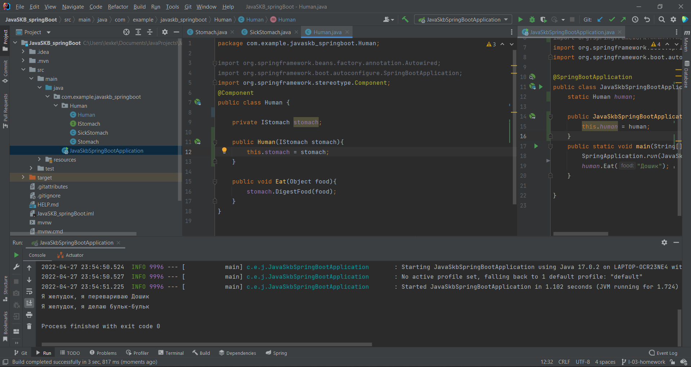
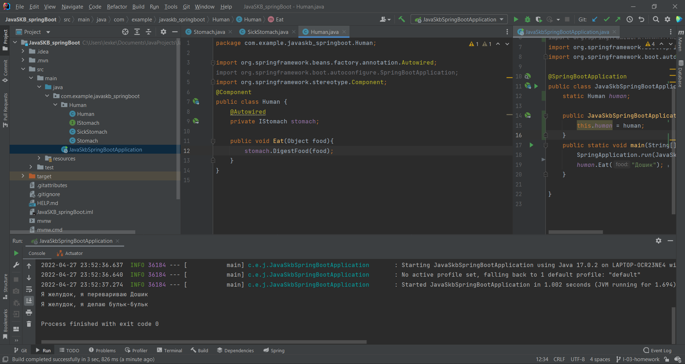
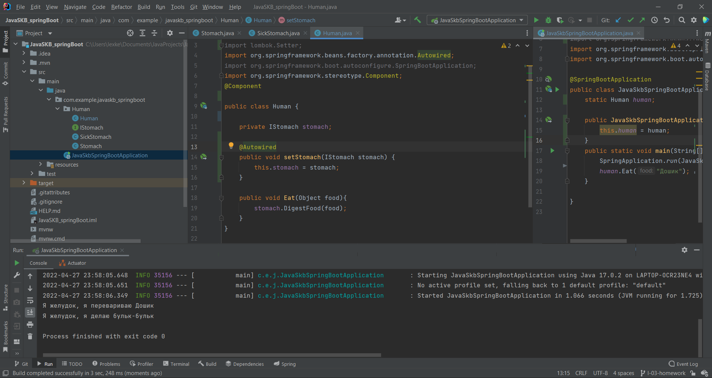
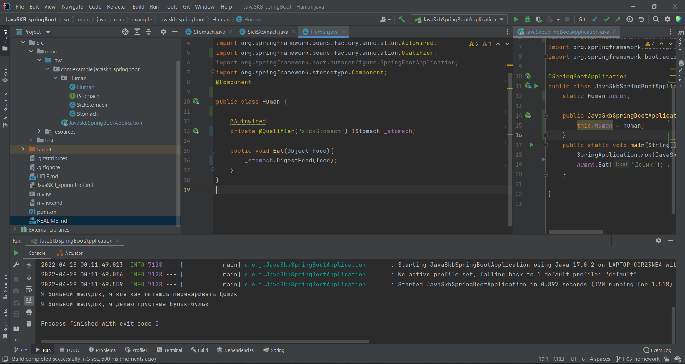
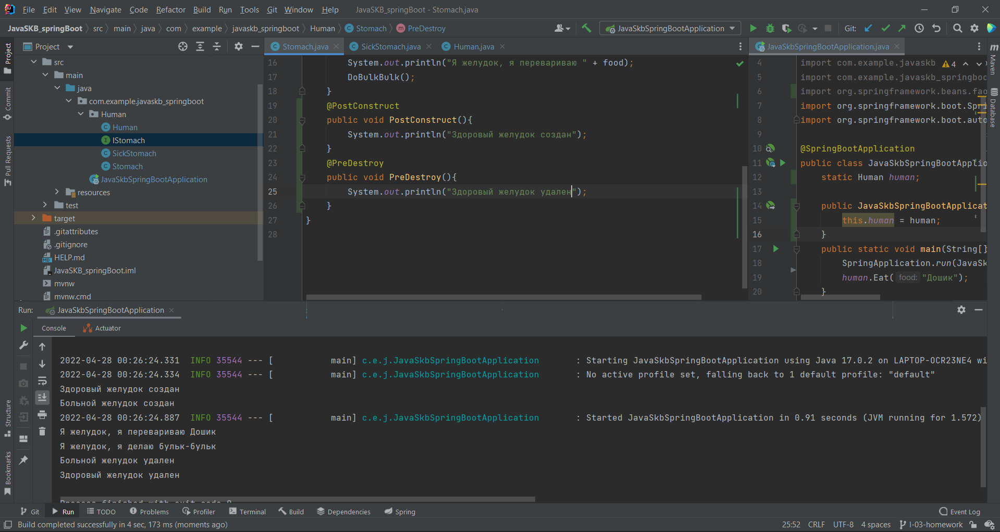

# Домашка по лекции 3:

---
## Dependency Injection

- # Сделать:
   - Реализовать приложение (не важно какая логика, так как основой упор идет на DI), в котором:
      - используется внедрение через конструктор
      - используется внедрение через поле
      - используется внедрение через сеттеры
      - создаются и внедряются два бина разных классов, но реализующих один интерфейс
      - при создании и “разрушении” бина в лог выводится сообщение

- # Решение:
    - Создал класс человека - Human, в котором есть внутренний класс stomach. Создал внедрение через:
      - конструктор: 
      - поле: 
      - сеттер: 
    - Были использованы интерфейс для возможности пользования нескольких классов stomach для поля основного класса human, а также 
аннотация @Qualifier для использования конкретной реализации класса:
    - При создании и удаления бинов в консоль выводятся соответствующие сообщения: 