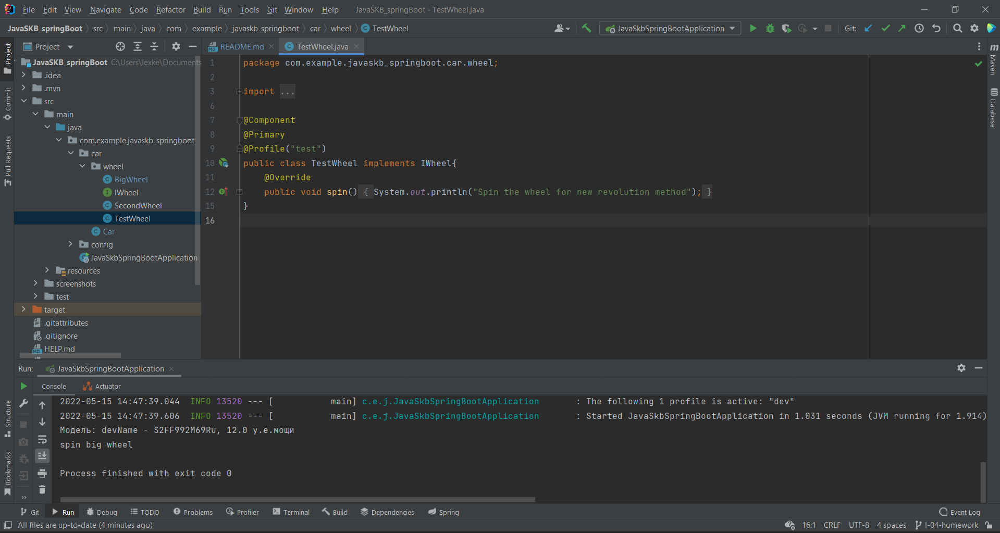
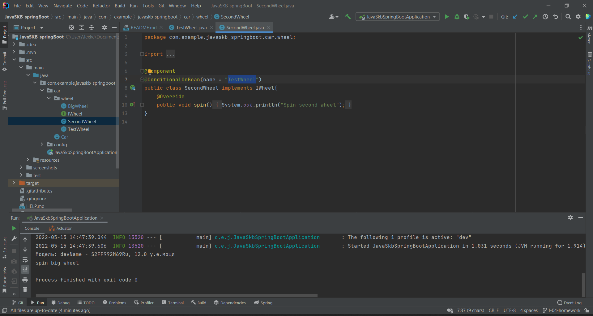
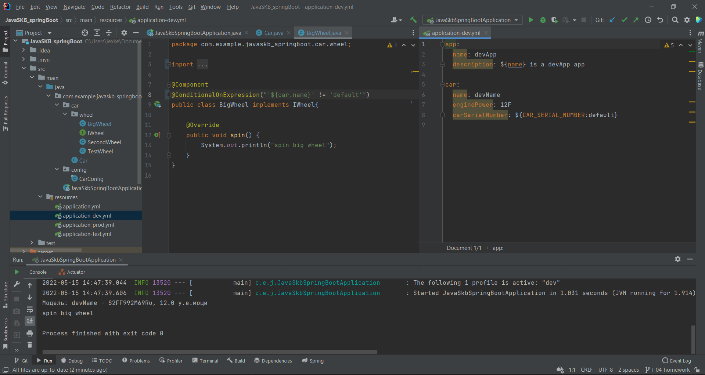

# Домашка по лекции 4:

---
## Профили
## Сделать:
- #### 1) Создать 3 профиля - dev, test, prod, каждый из которых будет включать в себя:
  - 1.1) конфиг с листом из нескольких значений
  - 1.2) название приложения
  - 1.3) конфиг с переменной окружения, по дефолту значение - default
- #### 2) 3 бина:
  - 2.1) один создается, только если профиль test,
  - 2.3) другой, если существует первый бин,
  - 2.3) третий, если в конфиге с не "default (тут в идеале со скриншотом)

## Решение:
- Бин "TestWheel" создается только если стоит профиль "Test":

- Бин "SecondWheel" создается только при существовании бина "TestWheel":

- Бин "BigWheel" создается только если в конфиге не "default (в моем случае, если "name" бина "Car" это "devName"):

