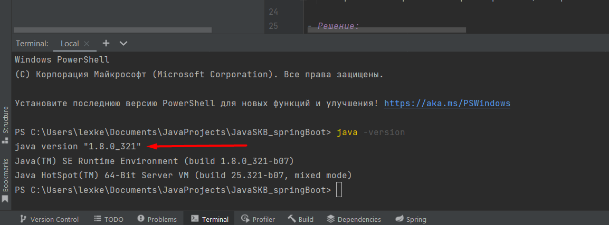

Домашка по лекции 1:
= 
---
JRE и JDK
-
- Сделать:
  - 
    - Установить openjdk.
    - Проверить работу из консоли, выполнив java --version.
    - Приложить скриншот выполнения

- Решение:
  - 

---
Maven/gradle
-
- Сделать:
  -
    - Собрать jar-файл, добавив какую-нибудь зависимость и использовав её в коде. Как для maven, так и для gradle.
    - Приложить скриншоты сборки и работающего приложения

- Решение:
  - 
  - Собрал проект. Добавил зависимость Lombok в проект на Maven и Gradle
    - 
    - 
